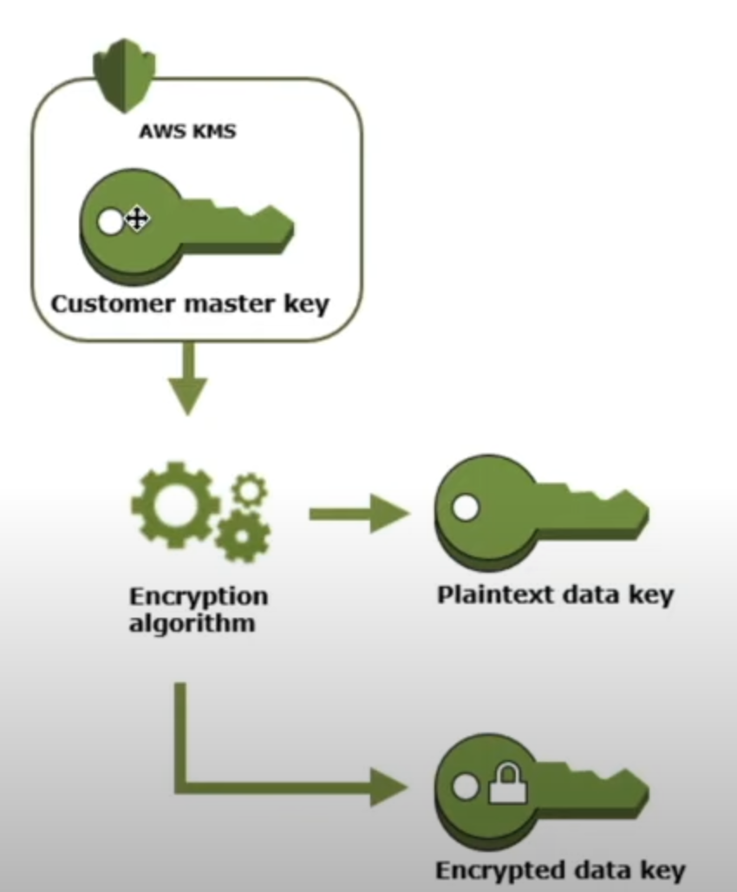

# Why Encryption?
If DB Server got hacked, hacker should be able to see the customer sensitive information(CII or PII). So we should follow
***Security by Design Architecture***.

# Implementation Mechanisms
Implementation of data encryption should be in following places:
- data in transit
- data in rest

### Data In Transit
There are already HTTPs(TLS/SSL) protocols which make sure that while transit data in encrypted.

### Data In Rest
To main terminologies:

##### Client Side Encryption
The data is encrypted at client side and send all the way down to backend. We can build our own key management service or 
use Key Management Services like *AWS KMS*

##### Server Side Encryption
The data is encrypted at server side. Backend applications takes care of encrypting the data and storing in DBs. We can 
build our own key management service or use Key Management Services like *AWS KMS*

# Key Management Solutions

### AWS KMS(Key Management Service)
- The service which manages encryption keys, it only manages *CMKs(Customer Master Key)*. Does not manage data keys
- It uses Hardware Security Modules to store CMKs i.e. the CMK never goes out of the H/W and only can be used by APIs
- Integrated with most of the AWS services
- Uses CloudTrail to log the usage logs for audit and compliance purpose

##### CMK(Customer Master Key)
- Never leaves the region or H/W it was created in. AWS CLI or AWS KMS APIs can be used to interact with it.
- Can only encrypt maximum of 4KB data (*Use Data Keys for encrypting data more than 4KB*).

##### Data Encryption Key

##### Generate Data Key
<table>
    <tr>
        <td>
            
        </td>
        <td>
            <ul>
                <li>CMK is used to generate Data Keys</li> 
                <li>It generates two keys: Plaintext Data Key & Encrypted Data Key as shown in the image below</li>
                <li>AWS KMS does not store, manage or track data keys</li>
            </ul>
        </td>
    </tr>
</table>

##### Encrypt Data

<table>
    <tr>
        <td>
            
        </td>
        <td>
            <ul>
                <li>Encrypt Data Using Plain Text Data Key</li> 
                <li>Delete Plain Text Data Key</li>
                <li>Use KMS API to decrypt the data using decrypted data key and CMK.</li>
            </ul>
        </td>
    </tr>
</table>

##### Decrypt Data
<table>
    <tr>
        <td>
            
        </td>
    </tr>
</table>

##### Steps

- Generate data keys
```shell
aws kms generate-data-key --key-id alias/test --key-spec AES_256 --region us-east-1
```

- 

